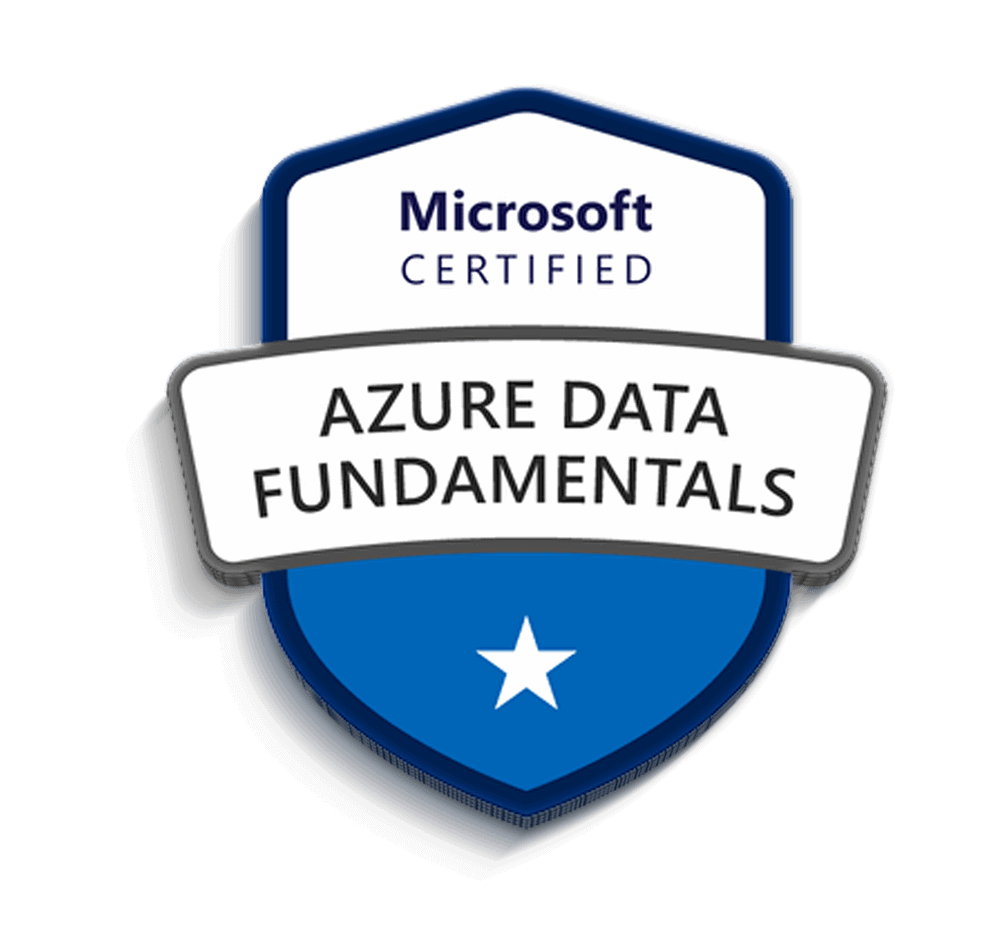

### Hi there 👋

 

> :man_technologist: I’m a junior Full-Stack Data Engineer.  
>  I'm a certified AWS cloud practitioner.  
> 🔭 I’m currently working on my portfolio to land my first career.  
>  I’m currently studying to get my Azure Data Fundamentals certification.  
> 📫 You can reach out to me via fawzi.elzein.0@gmail.com 
<!--**FawziElZein/FawziElZein** is a ✨ _special_ ✨ repository because its `README.md` (this file) appears on your GitHub profile.

Here are some ideas to get you started:

- 🔭 I’m currently working on ...
- 🌱 I’m currently learning ...
- 👯 I’m looking to collaborate on ...
- 🤔 I’m looking for help with ...
- 💬 Ask me about ...
- 📫 How to reach me: ...
- 😄 Pronouns: ...
- ⚡ Fun fact: ...
-->
